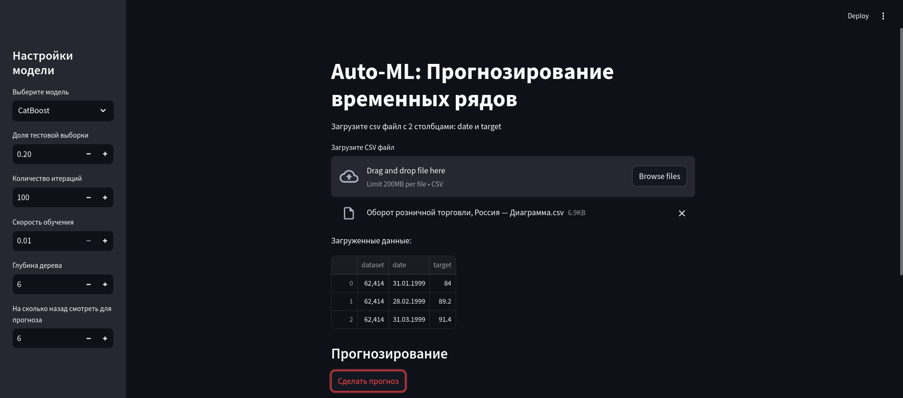
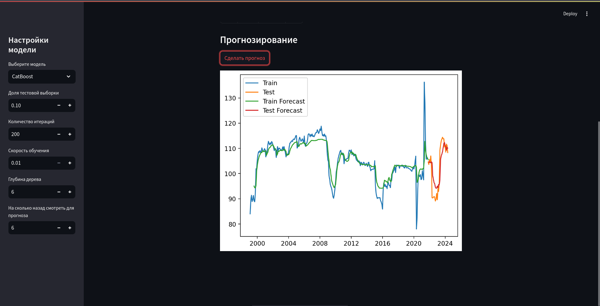

# auto-ml: Микро-приложение для удобного авторегрессионного прогноза временных рядов 





## Как запустить?

1. В папке проекта нужно создать и активировать виртуальное окружение Python

Установить виртуальное окружение в папке проекта можно следующим образом:
```bash
python3 -m venv venv
```

Далее, его активация на разных ОС выглядит по разному. Для Linux и MacOS это выглядит так
```bash
source ./venv/bin/activate
```

Для windows следующим образом
```PowerShell
venv\Scripts\activate.bat
```

2. Далее, нужно загрузить все зависимости
```bash
pip install -r requirements.txt
```

Note: Первые два этапа может автоматически сделать IDE (например, PyCharm)

3. Теперь для запуска приложения напишите в консоль
```shell
streamlit run index.py
```

После чего автоматически в браузере откроется окно 

## Какие данные нужно импортировать?

Нужно импортировать CSV файлы с разделителем `;` и столбцами:

| dataset        | date                      | target              |
|----------------|---------------------------|---------------------|
| Номер датасета | Дата в формате `%d.%m.%Y` | Значения показателя |

## Где брать данные
В таком формате данные хранятся на [сайте ВАВТа](https://data.vavt.ru/ru/analytic_sets/search?page=1&page_size=10). 
Только не забудьте удалить метаданные в начале файла (источник, дата последнего обновления и тп)

## Как добавлять свои модели?
Вот детальная инструкция. Если какой то момент непонятный, можете смотреть на то как это делается с CatBoost

### Со стороны Backend:
1. Создаем файл с классом новой прогнозной модели в `models/`
2. Наследуем его от `ForecastInterface` из `forecast_interface.py` и имплементируем все его методы: preprocess, fit и predict 
3. Импортируем класс в `__init__.py` в этой папке

Все готово, остается лишь добавить его в компоненты для пользователя
### Со стороны Frontend:
1. В `schemas/models_enum/ModelsEnum` добавляем поле с названием нашей модели. Теперь оно отображается в списке выбора модели
2. Далее в `components/modelSettings` создаем файл с функцией конфигурации нашей модели (какие параметры принимает)
3. После чего импортируем функцию в `__init__.py` в этой папке, добавляем новую условную конструкцию

Все готово! Можете перезагрузить страницу (если index.py запущен) либо запустить проект